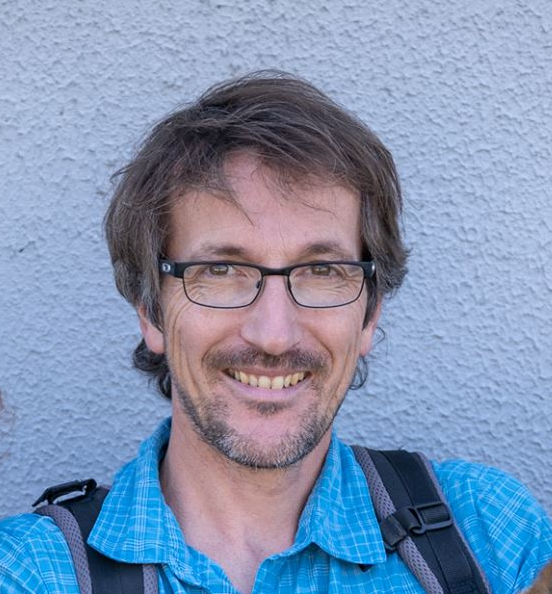
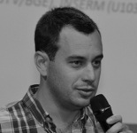

## Team presentation

### Core team

 
Samuel Wieczorek
 <a href="https://orcid.org/0000-0002-5016-1203" target="_blank"></a> <a href="https://scholar.google.fr/citations?hl=fr&user=K4CBghYAAAAJ" target="_blank"></a>

After a first career as IT support technician, Sam obtained an engineering degree (2004) at "Conservatoire National des Arts et Metiers",
followed by a MS degree in computer sciences and a PhD in machine learning (2009) at Grenoble-Alpes University.
Since then, he has been working as a research engineer at EDyP-lab, where he has been developing and maintaining software tools for proteomics.
Sam has been involved in Prostar project since its beginning.
He is the code guru and supervises all the software aspects of the project, such as coding, packaging, deployment,
debugging, graphical user interfaces, etc.

 
Thomas Burger
 <a href="https://orcid.org/0000-0003-3539-3564" target="_blank"></a> <a href="https://sites.google.com/site/thomasburgerswebpage" target="_blank"></a>

Tom is a CNRS senior scientist. He holds two MS degrees in computer sciences and applied mathematics (2004), 
a PhD in pattern recognition (2007) and a Habilitation thesis (2017), all from Grenoble Alpes University. 
Tom was an associate professor in machine learning with South Brittany University (2008-2011), before rushing back to his beloved mountains, 
with a CNRS position at EDyP-lab. 
He is the principal investigator of Prostar project.
His expertise focuses on the statistical, methodological and algorithmic aspects of proteomics data analysis.

**Contact us** - firstname.lastname@cea.fr

### Occasional contributors

Florence Combes

<a href="https://www.researchgate.net/scientific-contributions/Florence-Combes-84912639" target="_blank"></a> <a href="https://scholar.google.fr/citations?hl=fr&user=IJj2oUsAAAAJ" target="_blank"></a>

Quentin Giai-Gianetto

<a href="https://orcid.org/0000-0001-6815-2498" target="_blank"></a> <a href="https://research.pasteur.fr/fr/member/quentin-giai-gianetto/" target="_blank"></a>

(Institut Pasteur, France)

Laurent Gatto

<a href="https://orcid.org/0000-0002-1520-2268" target="_blank"></a> <a href="https://lgatto.codeberg.page/" target="_blank"></a>

(Université catholique de Louvain, Belgique)

Cosmin Lazar

<a href="https://www.researchgate.net/profile/Cosmin-Lazar" target="_blank"></a> <a href="https://scholar.google.fr/citations?hl=fr&user=gHyBfNwAAAAJ" target="_blank"></a>

Helene Borges

<a href="https://www.researchgate.net/profile/Helene-Borges" target="_blank"></a> <a href="https://scholar.google.fr/citations?hl=fr&user=yYroo3gAAAAJ" target="_blank"></a>

Yohann Couté

<a href="https://orcid.org/0000-0003-3896-6196" target="_blank"></a> <a href="https://scholar.google.fr/citations?user=pUQIR6wAAAAJ&hl=fr" target="_blank"></a>

Christophe Bruley

<a href="https://www.researchgate.net/profile/Christophe-Bruley" target="_blank"></a> <a href="https://scholar.google.fr/citations?hl=fr&user=pnV6KrsAAAAJ" target="_blank"></a>

Anne-Marie Hesse

<a href="https://orcid.org/0000-0001-6110-0636" target="_blank"></a> <a href="https://scholar.google.fr/citations?hl=fr&user=DfkciI8AAAAJ" target="_blank"></a>

Alexia Dorffer

Enora Fremy

<a href="https://www.linkedin.com/in/enora-fremy-68486a102/" target="_blank"></a>

### Beta-testing & co.

**The entire [EDyP proteomics platform](http://www.edyp.fr)**  
Prostar being permanently hosted by EDyP lab, the first users (the original ones, but also the testers) are naturally the lab members.
They are all warmly acknowledged for their contributions.

## Bug report

To report any issue with Prostar, it is best to use the devoted tab in Prostar software (click on **Bug report** in the **Help menu**),
as it allows easy sharing of the session logs and data (essential to efficient debugging).

However, it is also possible to contact the development team by email (see [team presentation](#team-presentation)).

## Happiness report

**If you are pleased with your Prostar experience**, you can also send us a message (messages are not restricted to bug reports)!  
:-)

Do not forget to [cite Prostar in your publications](./#citation)!
