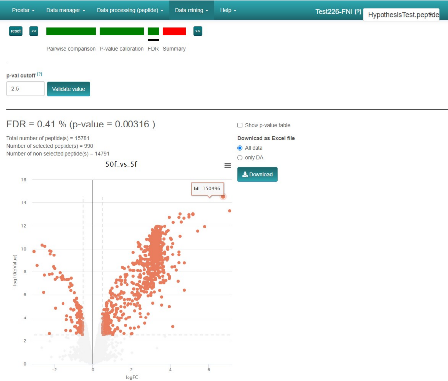

PROteomic STatistical Analysis with R

**Prostar** is a software for the **statistical analysis of quantitative data** from discovery proteomics experiments. Its **user-friendly**, [Shiny](https://shiny.rstudio.com/)-based interface provides an **accessible workflow** for exploring, processing, and performing differential analysis of **proteomics datasets**.

Prostar brings together established and state-of-the-art data analysis methods in a documented and **continuously updated** and **easy to install** environment, making advanced **proteomics analysis accessible** without requiring extensive programming expertise.

  <a href="/discoverprostar.html" class="custom-button">Learn more</a>
  <a href="/download.html" class="custom-button">Get Prostar</a>

## News
<table><tr><td style="width: 5%;">
<td>
**25/11/2024**
<td style="width: 100%;">
</table>

**Enjoy the [Zero-install version of Prostar](/download.html#zero-install) !**

* Prostar version 1.38.1 has been released on the Bioconductor (release 3.20) and is deployed as a [Zero-install](/download.html#zero-install) zip.

## Citation
**Maintaining Prostar as free software is a heavy duty. Please cite the following reference**

> *S. Wieczorek, F. Combes, C. Lazar, Q. Giai-Gianetto, L. Gatto, A. Dorffer, A.-M. Hesse, Y. Couté, M. Ferro, C. Bruley and T. Burger*.
DAPAR & ProStaR: software to perform statistical analyses in quantitative discovery proteomics.
**Bioinformatics** 33(1), 135-136, 2017.  
<a href="http://doi.org/10.1093/bioinformatics/btw580" target="_blank">http://doi.org/10.1093/bioinformatics/btw580.</a>